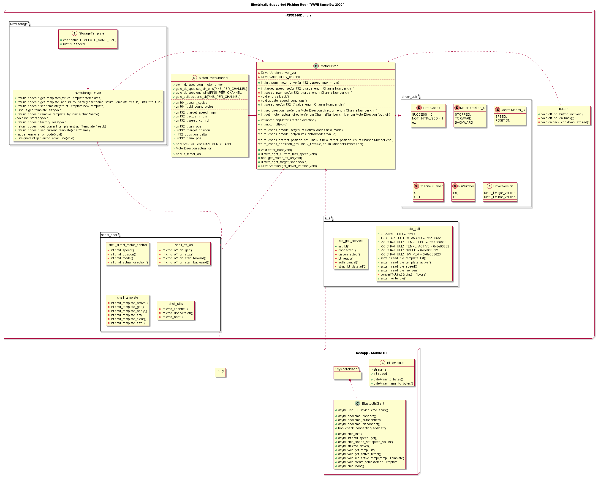

# Electrically-supported-fishing-rod

Design and implementation of a specialised fishing rod with automatic line winder allowing one-handed operation, for people with disabilities.

## Software

### Architecture overview

### Firmware

Created in C, based on Zephyr Real Time Operating System for embedded applications.

#### General Purpose Brushed Motor Controller
[Brushed Motor Controller Firmware repository](https://github.com/eSqadron/NRF52840-Brushed-Motor-Controller-Firmware) has been created for the purpouse of this project. Later on it was separated as stand-alone library.
Components from library used in this project:
* Stable speed control - used to control the motor's rotation at even speed, regardless of the load. Utilizes PID controller and PWM modulation.
* Templates - each fish requires different speed of pulling. Templates allow to save such data into the NVM (Non-volatile memory) and apply it from memory.
* Turning motor on and off using signal pins from Toshiba controller.
* UART shell control over driver APIs - for debugging purpouses.
* BT control over driver APIs - for mobile app purpouses.

#### Other peripherals:
* Button - controlling on/off status of motor spinning.

### Hostapp - Desktop
[NRF52840 Brushed Motor Controller HostApp](https://github.com/eSqadron/NRF52840-Brushed-Motor-Controller-HostApp), has been written in C#, Avalonia framework. Used for debug purpouses with wired (UART) connection. Will be removed from final software build and reused as a generic application for control over [General Purpoouse Brushed Motor Controller](https://github.com/eSqadron/NRF52840-Brushed-Motor-Controller-Firmware)

### Hostapp - BT mobile
Mobile App has been build with kivy framework and bleak library. It allows user to control the fishing rod via bluetooth.
#### Functionalities:
 - adding, removing and activating templates

## Electronics
[Electrically supported fishing rod hardware](https://github.com/KN-Integra/Electrically-supported-fishing-rod-hardware) - purpouse-designed and printed PCB board, created in Altium.

## Mechanical Designs
### 3D models
[3D Models Repository](https://drive.google.com/drive/folders/1soIZqvbjTYA_fR7IgqiSM9d02fvre1W5)

### Motor

Pololu 2828 was used, for it's low speed and high torque. It also includes encoder.

## Sources
* [nRF52840 Dongle user manual](https://infocenter.nordicsemi.com/pdf/nRF52840_Dongle_User_Guide_v1.0.pdf)
* [nRF52840 Dongle schematics](https://devzone.nordicsemi.com/cfs-file/__key/support-attachments/beef5d1b77644c448dabff31668f3a47-ab48524591d842238bd2e0a2929469c4/pca10059_5F00_schematic_5F00_and_5F00_pcb.pdf)
* [Polulu 2828 motor documentation](https://www.pololu.com/product/2828)
